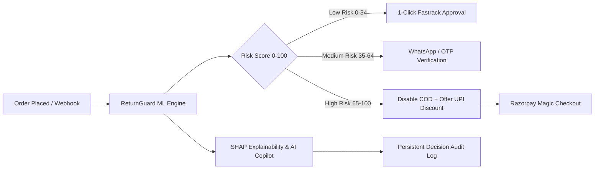

#  ReturnGuard — AI Risk Manager for Razorpay

> **Razorpay AI Buildathon — Track 02: AI Risk Manager**  
> *An intelligent return-risk scoring engine & dynamic checkout intervention system designed to eliminate RTO (Return to Origin) losses and return fraud for Indian merchants.*


---

## 📌 Executive Summary & The Problem

In Indian e-commerce, **Return to Origin (RTO)** and return fraud drain over **₹30,000 Crores annually**. 
- **Cash on Delivery (COD)** orders suffer 3x to 4x higher return rates than prepaid orders.
- Traditional rules engines are either **too lenient** (bleeding logistics & reverse shipping costs) or **too strict** (blocking high-intent genuine customers, destroying conversion rates).
- Merchants lack real-time visibility into **why** an order is risky and how to intervene before shipping.

**ReturnGuard** solves this by combining **Random Forest ML**, **SHAP feature attribution**, and **Razorpay Checkout APIs** into a closed-loop merchant protection suite.

---

## ⚡ Key Capabilities



### 1.  Precision ML Scoring & SHAP Explainability
- Trained on **10,000 Indian e-commerce transactions** with realistic demographic, payment, and velocity distributions.
- **SHAP (SHapley Additive exPlanations)** calculates exact feature attribution per transaction (e.g. *Tier-3 COD increases risk by +0.32*, *Loyal Customer reduces risk by -0.28*).
- **Model Performance**: Achieves **~40% Precision**, **~39% Recall**, and **~0.79 AUC-ROC** on the synthetic test split, representing realistic RTO return behavior profiles.

### 2.  Merchant Economics & Policy Simulator
- Balances **False Positive Cost** (blocked revenue) against **False Negative Cost** (RTO logistics loss).
- Interactive **Threshold Tuner** lets merchants calibrate their risk posture in real-time (Strict vs Balanced vs Growth mode) with live monthly net savings projections.

### 3.  Dynamic Razorpay Checkout Interventions
- High-risk orders automatically **disable COD** and inject an **instant UPI discount offer** (e.g. ₹200 off) to convert risky COD orders into verified prepaid payments.
- Supports both interactive **Mobile Simulator** and the official **Razorpay Standard Checkout Modal (`checkout.razorpay.com/v1/checkout.js`)**.

### 4.  AI Risk Copilot & 1-Click WhatsApp Verification
- Generates executive forensic risk briefs explaining anomalous behavior.
- Provides a ready-to-dispatch **1-Click WhatsApp verification message** for delivery teams to confirm high-risk addresses before fulfillment.

### 5.  Live Razorpay Webhooks Listener
- Production-ready `POST /api/webhook/razorpay` endpoint with **HMAC-SHA256 signature verification** (`X-Razorpay-Signature`) to intercept live payment events from the Razorpay Dashboard.

### 6.  Batch Processing & Persistent Audit Trail
- Scores up to **10,000 orders** in batch mode with instant CSV export.
- Maintains a persistent JSON-backed **Decision Audit Ledger** with 1-click CSV & JSON download for merchant compliance.

---

##  System Architecture

```
risk-scorer/
├── backend/
│   ├── app.py              # Flask API with Live Razorpay Webhook & Checkout endpoints
│   ├── model.py            # Random Forest ML pipeline, SHAP explainer & metrics evaluation
│   ├── scorer.py           # Real-time scoring engine, AI Copilot & WhatsApp generator
│   ├── generate_data.py    # 10,000-order synthetic dataset generator
│   ├── jarvis.py           # Jarvis AI Copilot assistant and API query handler
│   ├── data/               # Persistent transactions & audit trail
│   └── models/             # Trained ML artifacts (.pkl & metrics.json)
├── frontend/
│   ├── index.html          # Interactive Dashboard, 1-Click Presets & Checkout Simulator
│   ├── style.css           # Premium Dark-Mode Fintech Design System
│   └── app.js              # Frontend state, charts, Razorpay SDK & API orchestration
├── Procfile                # 1-Click Render / Heroku deployment config
├── render.yaml             # Render infrastructure-as-code blueprint
├── Dockerfile              # Containerized deployment for Railway / Cloud Run
├── requirements.txt        # Production dependencies
└── README.md
```

---

##  Quick Start (Run Locally)

### 1. Clone & Install Dependencies
```bash
git clone https://github.com/your-username/returnguard-razorpay.git
cd returnguard-razorpay
pip install -r requirements.txt
```

### 2. Start the Server
```bash
cd backend
python app.py
```

The application will automatically:
1. Generate the 10,000-transaction training dataset (if not present).
2. Train the Random Forest & SHAP TreeExplainer.
3. Launch the API & Web Dashboard at `http://localhost:8000`.

Open **`http://localhost:8000`** in your browser.

---


## 🔌 API Reference

| Method | Endpoint | Description |
| :--- | :--- | :--- |
| `GET` | `/api/metrics` | Returns model precision, recall, F1, AUC, and threshold curves |
| `GET` | `/api/scenarios` | 1-Click preset scenarios for fast hackathon judging |
| `POST` | `/api/score` | Scores an order with SHAP attribution & AI Copilot insights |
| `GET` | `/api/score-batch` | Batch scores 10,000 transactions with summary statistics |
| `POST` | `/api/webhook/razorpay` | Production Razorpay webhook receiver with HMAC-SHA256 verification |
| `POST` | `/api/webhook/simulate` | Simulates genuine Razorpay webhook payloads for UI demos |
| `POST` | `/api/razorpay/create-order` | Generates Razorpay order payload for Standard Checkout JS |
| `POST` | `/api/checkout/simulate` | Dynamic checkout UX simulator (COD gating / UPI discounts) |
| `GET` | `/api/audit-log` | Returns the persistent decision ledger |
| `GET` | `/api/audit-log/export?format=csv` | Exports decision audit log as CSV |
| `GET` | `/api/health` | Service health check |
| `POST` | `/api/chat` | Chat with Jarvis AI Risk Copilot chatbot |

---

*"!Thank you!"*

---

## 🛡️ Responsible AI & Defense-Only
ReturnGuard is designed strictly for **merchant defense and fraud mitigation**. It operates within ethical ML guidelines, providing transparent SHAP attribution without biased demographic profiling.
